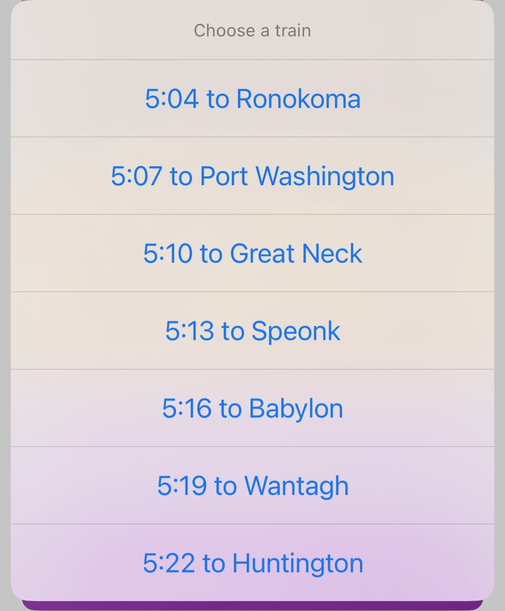
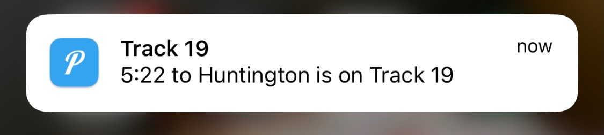

# Lirr Track Notification
 Send Pushover Notifcation when track announced for LIRR trains at NY Penn Station using App hosted on Heroku and iOS Scriptable
|  | |
| --- | --- |
|  |  |

 ## Setup instructions
 1. Fill in your pushover App Key and User Key in `Get Penn Platform Lirr.js` and `lirrNotify.py`
 2. Upload to heroku / your favorite hosting service and modify `Get Penn Platform Lirr.js` with the hosted URL
 3. Transfer `Get Penn Platform Lirr.js` to your scriptable app
 4. Run in scriptable, select a train, and wait for your notification

